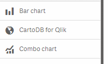
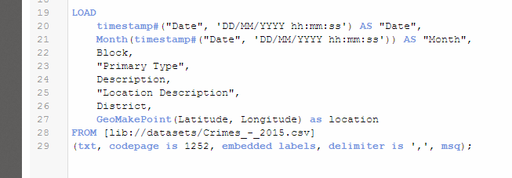
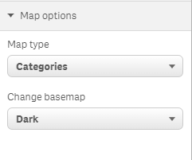
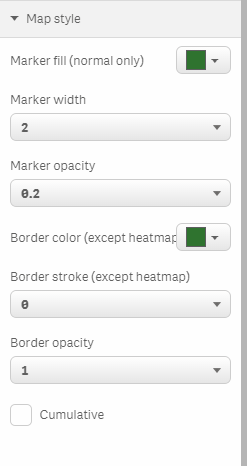
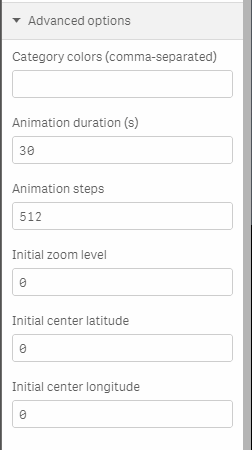
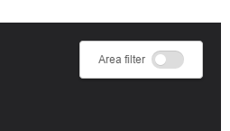

# CARTO for Qlik

_CARTO's Torque maps on Qlik_

CartoQlik allows you to use CARTO's Torque map rendering library on Qlik Sense.

## Features

* Static and animated maps, including heatmaps and category maps.
* Integrates with Qlik's data, and can also be used for data filtering.
* Easily change map layout, basemaps or animation parameters.
* Works nicely with even hundred thousand points.

## Installation

Copy the project folder under `<your HD unit>:\Users\<your user name>\Documents\Qlik\Sense\Extensions`, you should now see the _CARTO for Qlik_ extension on the charts tab.

## Data

_CARTO for Qlik_ works with 2 dimensions and 1 measure:

### Dimensions

* Location: this is a GeoMakePoint string made from your latitude and longitude columns. This dimension is mandatory and must be the first one added to a map.
* Timestamp: this can either be an integer or a real timestamp.

This is an example of a typical data import script, when it comes down to defining these two dimensions:

### Measure

_CARTO for Qlik_ can make use of 1 measure, depending on the type of map.

* For a category map, this measure defines the data column that will be used to categorize the map. This measure shouldn't be aggregated.

* For any other map, this measure defines the data column and the aggregation function that will be used on the map.

## Map configuration

### Map options

* Map type:
  * Normal: Draws colored points based on location and, if defined, time and/or aggregation.
  * Categories: Draws colored points where each color represents a category based on the value of the column set as measure.
  * Heatmap: Heatmap based on point aggregation.
* Basemap:
  * Light: Our _Positron_ basemap.
  * Dark: Our _Dark matter_ basemap.

### Map style

* Marker fill: Color of point fills.
* Marker width: Point diameter in pixels.
* Marker opacity: (0-1).
* Border color
* Border stroke: Border width.
* Border opacity: (0-1)
* Cumulative: Only for animated maps. If set, new points remain visible until the map loops.

### Advanced options

* Category colors: Category are given random colors. However, it's possible to use a comma-separated list of colors from this field too. If there were more categories than items in this list, random colors would be used for the remaining.
* Animation duration: In seconds.
* Animation steps: Number of total frames for the animation. Typical values are: 256, 512 or 1024
* Initial zoom level, zero latitude and zero longitude: If set, the initial bounding box upon page reload will be taken from these values. If not set (or set to 0), the map will automatically fit its bounds.

## Area filter

When the area filter switch is enabled, data that falls out of the bounding box of the map is filtered out.
